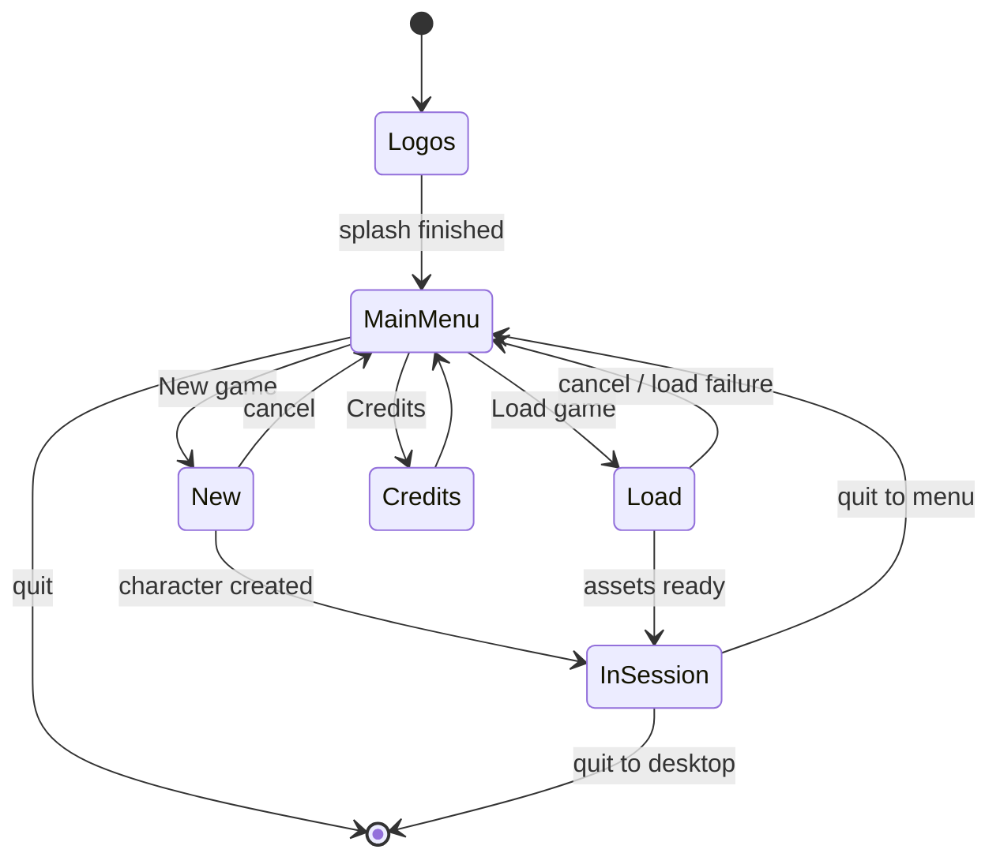
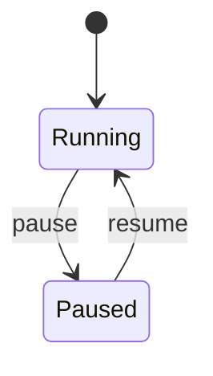
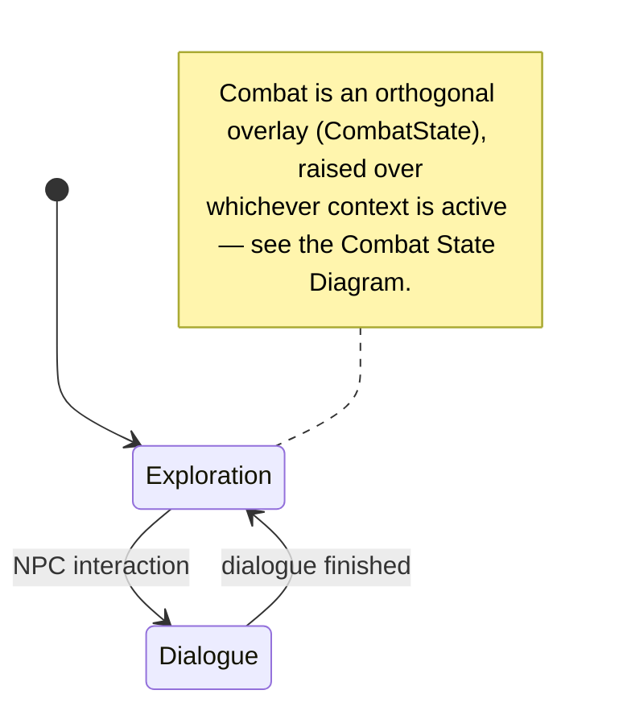
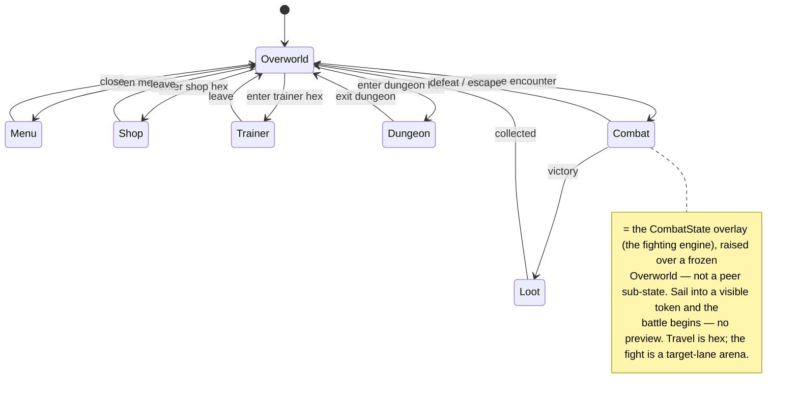
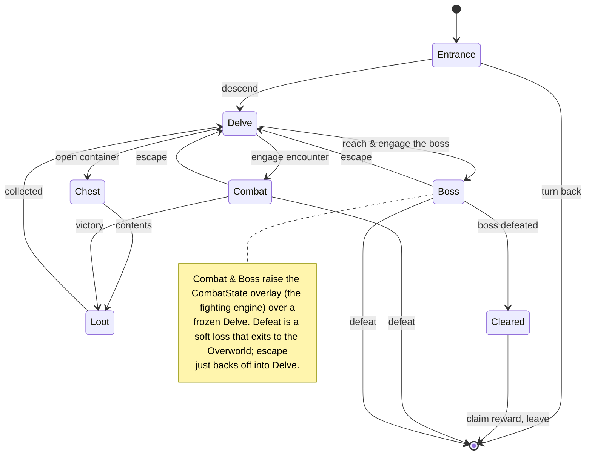
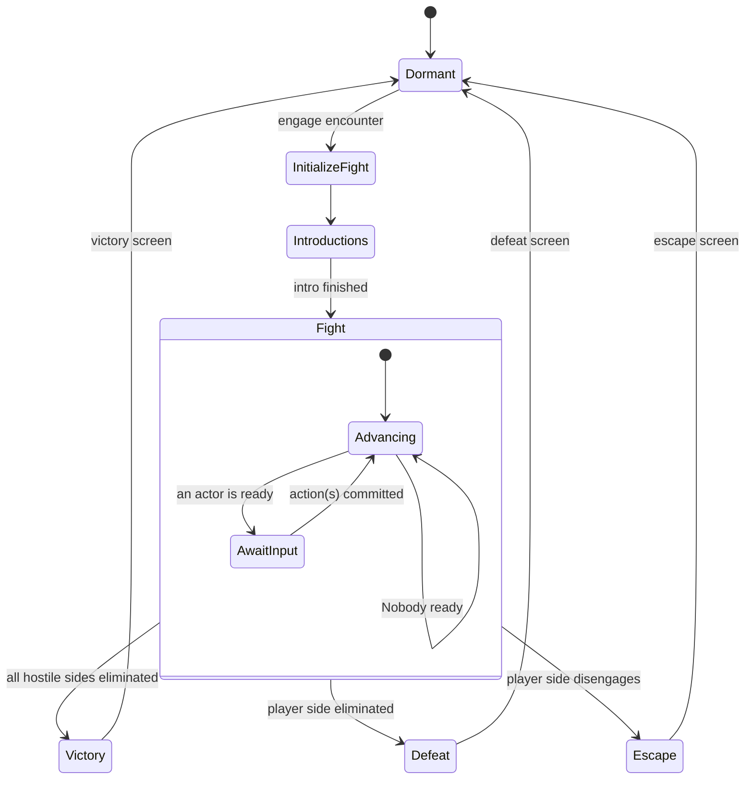
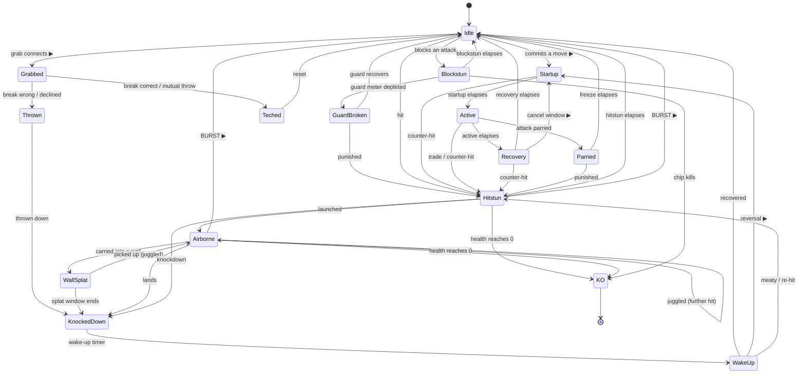

# Finite State Machine

*Updated 2026-06-09 for spec v2 (`frame_rpg_spec.md`): party battles on target-lanes, the fog of
war, grab-break and burst reaction windows. Diagram structure is otherwise unchanged.*

## Overall State Diagram

### State Descriptions

*Bevy: the top-level `States` (e.g. `AppState`) — the application shell / lifecycle. `Pause` is **not** here; it's an orthogonal machine (see **Pause State Diagram**).*

- **Logos** — Boot splash (publisher / engine logos). Auto-advances to `MainMenu` when the splash sequence finishes. No world or save loaded.
- **MainMenu** — Title screen and root menu hub. Branches to `New`, `Load`, or `Credits`, or quits the application.
- **New** — New-game flow (character creation, fresh save). On `character created`, hands off to `InSession`; `cancel` returns to `MainMenu`.
- **Load** — Reads a save and streams assets. Advances to `InSession` on `assets ready`; returns to `MainMenu` on `cancel` / `load failure`.
- **Credits** — Scrolling credits; returns to `MainMenu` when finished or dismissed.
- **InSession** — A game is loaded and live. The gameplay itself is the separate **Game State Diagram** instance (with its `Combat` sub-machine); `InSession` just means "that machine is running." Exits to `MainMenu` (`quit to menu`) or the desktop (`quit to desktop`), triggered from the pause menu or game UI.

## Pause State Diagram

`Pause` is an **orthogonal** state machine, separate from `AppState` and meaningful only during `InSession`. It does not change `AppState` or `GameState` — it gates the gameplay systems (`…run_if(in_state(Running))`), so `Paused` *freezes* the running game while every game-state value is retained. `resume` continues exactly where it left off, with no save/restore.

### State Descriptions

*Bevy: its own top-level `States` (e.g. `PauseState`), orthogonal to `AppState`; only acted on during `AppState::InSession`.*

- **Running** — Normal play; the gameplay systems tick. The default.
- **Paused** — Gameplay systems are frozen by their run-conditions while `GameState` / `CombatState` keep their values; the pause menu runs here. `resume` → `Running`. Quitting from the pause menu sets `AppState` (→ `MainMenu` or desktop) and resets `PauseState` to `Running`.

## Game State Diagram

The **Game** is its own state-machine instance — *not* a sub-state of `AppState`. It is activated when a session begins (`OnEnter(AppState::InSession)`) and runs until the session ends. It carries the **world context** — `Exploration` or `Dialogue`; combat is a separate overlay (the **Combat State Diagram**), *not* a value here. While `PauseState == Paused` it is **frozen, not destroyed**, so this machine — and its sub-states — keep their state across a pause untouched.

### State Descriptions

*Bevy: its own top-level `States` instance (e.g. `GameState`, default `Inactive`), switched on at `OnEnter(AppState::InSession)` and frozen by `PauseState` — not a `SubState` of `AppState`. Combat is the separate orthogonal `CombatState` axis, not a value here.*

- **Exploration** — Default free-roam gameplay and the session's entry point: traverse the world and trigger content. Raises the `CombatState` overlay on `encounter`; → `Dialogue` on `NPC interaction`.
- **Dialogue** — Conversation or scripted interaction with an NPC. → `Exploration` when `dialogue finished`; raises the `CombatState` overlay when `combat triggered`.

Combat is no longer a `GameState` value: engaging an encounter raises the orthogonal **`CombatState`** overlay (the **Combat State Diagram**) while the world context here is *frozen*, then resumes when the fight ends. Defeat is a soft loss that simply lowers the overlay back onto `Exploration` (see **Open questions**).

## Exploration State Diagram

Expands `GameState::Exploration`. A **hexgrid overworld of fog and islands** (see
[`exploration.md`](./exploration.md)): you sail hex to hex through the Fog, and **encounters are
visible tokens on the map** (no random encounters) alongside points of interest — ports, trainers,
masters' anchor islands, and the entrances to **dungeons**. What pulls you into fights is the
payoff — the combat itself plus **Diablo / Borderlands-style loot** — not a punishing grind.

**Navigation vs combat:** the hexgrid is the *navigation layer only*. Engaging an encounter raises the fighting engine as an overlay (the orthogonal `CombatState` axis), which uses the target-lane arena model (spec §3) while the overworld is frozen beneath it — the hex map is never the combat arena. Two spatial models, cleanly separated; the engaged hex authors the `ArenaDef` (walls, hazards — `exploration.md` §8).

### State Descriptions

*Bevy: `SubStates` of `GameState::Exploration`. `Dungeon` is expanded by the **Dungeon State Diagram**; `Combat` here is the orthogonal `CombatState` overlay (a frozen `Overworld` underneath), not a sub-state.*

- **Overworld** — The hexgrid map and entry point. Move hex to hex; visible encounter tokens and POIs (shops, trainers, dungeon entrances) occupy hexes. No random encounters — you see the enemies, and walking into one starts the battle.
- **Combat** — The fight; **the `CombatState` overlay** (the fighting engine), raised over a frozen `Overworld` by engaging a visible encounter, no preview step. Victory → `Loot`; defeat (soft loss) or escape → `Overworld`.
- **Loot** — The reward beat: rolled drops in the **Diablo / Borderlands** mould (item base × rarity tier × affix rolls; weapons remain your spacing identity). Collect → inventory → `Overworld`. *Generation is a data system, not an FSM — this state is just the pickup moment.*
- **Shop** — A shopkeeper hex: buy / sell. → `Overworld`.
- **Trainer** — A skill-trainer hex: spend points, rank weapon skills (which unlock & improve moves), choose foci. → `Overworld`.
- **Dungeon** — Entered from a dungeon-entrance hex; its own instance (see **Dungeon State Diagram**). → `Overworld` on exit.
- **Menu** — Overlay for inventory / character sheet / **move loadout** / map; freezes the world like `Pause` freezes the game (the orthogonal-freeze pattern). Where you equip looted gear and built moves.

## Dungeon State Diagram

Expands `Exploration::Dungeon` — an individual dungeon instance sprinkled into the overworld. Same **traverse → engage a visible encounter → loot** core as the overworld, plus an entrance / exit and a boss. (Authored vs procedural layout is deferred; this FSM doesn't care which.)

### State Descriptions

*Bevy: `SubStates` of `Exploration::Dungeon`. Reuses the overworld's overlay `Combat → Loot` loop.*

- **Entrance** — The threshold: `descend` into the dungeon, or `turn back` to the `Overworld`.
- **Delve** — Traverse the interior (rooms or a local grid); visible encounters, chests, and the boss live here. The dungeon's `Overworld` equivalent.
- **Chest** — A loot container → `Loot`.
- **Combat / Loot** — The same loop as the overworld: engage a visible encounter (no preview) into the fighting engine, collect drops, return to `Delve`. Escape backs off into `Delve`; defeat is a soft loss to the `Overworld`.
- **Boss** — The culminating encounter (also the fighting engine). Defeating it → `Cleared`.
- **Cleared** — Dungeon complete: claim the boss reward (a guaranteed high-tier drop / unlock) and leave to the `Overworld`.

## Combat State Diagram

Combat is an **orthogonal overlay axis** (`CombatState`), *not* a value inside `GameState`. `Dormant` means no fight; engaging an encounter raises it, and while it's non-`Dormant` the world context (`Exploration` / `Dialogue` and its sub-states) is **frozen**, then resumes when the overlay lowers — the same freeze pattern as `Pause`. The non-`Dormant` values are the phases of a single encounter.

### State Descriptions

*Bevy: a top-level `States` (`CombatState`, default `Dormant`), orthogonal to `GameState` and frozen by `PauseState` — not a `SubState`. The `Fight` value's tick loop is the `FightState` sub-state.*

- **Dormant** — No fight in progress; the overlay is off and the world context (`Exploration` / `Dialogue`) runs. The default. `engage encounter` raises the overlay → `InitializeFight`.
- **InitializeFight** — One-time setup: author the `ArenaDef` from the engaged hex (walls, hazards — `exploration.md` §8), spawn the actors, assign sides and initial targets, place them in the arena, and build their runtime state (compiled Fighters, meters, latches). Auto-advances to `Introductions`.
- **Introductions** — Pre-fight presentation (character intros, "Fight!"). → `Fight` when `intro finished`.
- **Fight** — The live exchange; the shared-tick simulation runs here. Actors belong to **sides** (party battles are the normal case — the player commits for every allied actor), and a side is out when all its actors reach `KO`. The outcome is evaluated each tick and breaks out to `Victory` (only the player's side remains), `Defeat` (the player's side is eliminated — a full wipe; companion KOs alone don't end the fight), or `Escape` (the player's side disengages).
  - **Advancing** — The engine advances the shared tick clock and applies any contacts resolving this tick. Self-loops while `Nobody ready`.
  - **AwaitInput** — Entered when any decision is pending at the current tick: a **Ready** actor, an open **Cancel** window, a **Reaction** window (throw break, burst), or a **Wake-up** choice (spec §4.1). Same-tick decisions are gathered and committed **side-blind** (spec §4.2): each side commits all of its actors' choices without seeing the other side's same-tick commitments; intent stays fogged either way (spec §7). Returns to `Advancing` once `action(s) committed`.
- **Victory** — The player's side is the last standing (all hostile sides eliminated); shows the victory screen, then lowers the overlay (→ `Dormant`). The frozen world context resumes and routes the retained `Exploration` / `Dungeon` layer to `Loot`.
- **Defeat** — The player's side is eliminated; shows the defeat screen, then lowers the overlay (→ `Dormant`). Soft loss — the frozen world context (already `Exploration`) resumes (may change later).
- **Escape** — The player's side disengages; shows the escape screen, then lowers the overlay (→ `Dormant`); the world context resumes.

A fight is one continuous bout that ends only on elimination — no rounds, no timer. See **Open questions** for the termination-cap and double-KO caveats that implies.

## Combat Actor State Diagram

### State Descriptions

*Bevy: a per-actor **component** — one instance per fighter, not a global `States`. Lives while `Combat` is in `Fight`. ▶ = the actor feeds the engine input; ✖ = locked, only receives.*

*Orthogonal per-actor axes, deliberately **not** states in this machine: **stance**
(standing / crouching — a held quality that changes height interactions, spec §5.2), **target**
(who this actor's lane points at, spec §3.2), and the **Heat / Rage latches** (spec §9.5–9.6).
`Crumple` is a data-flavored `Hitstun` variant; `Screw`/`Bound` are data-flavored `Airborne`
juggle events — the reaction union (spec §6.1) flavors these states rather than multiplying them.*

**Offense**
- **Idle** ▶ — Neutral and fully actionable; auto-faces the opponent. The actor chooses its next action here. → `Startup` (move), `Blockstun` (block), `Hitstun` / `Thrown` (attacked).
- **Startup** ✖ — Committed to a move, winding up (the move's `startup` frames). Vulnerable to counter-hits.
- **Active** ✖ — The move's `active` frames; this actor's hitbox is live. May be `Parried`, or trade into `Hitstun`.
- **Recovery** ✖ ▶ — The move's `recovery` frames. Locked, except a cancel window accepts the next move (▶) → `Startup`; otherwise → `Idle`.

**Guard**
- **Blockstun** ✖ — Holding guard against a connected attack for the move's `blockstun`; takes chip. → `Idle`; → `GuardBroken` if the guard meter depletes; → `KO` on chip kill.
- **GuardBroken** ✖ — Guard shattered: a long, punishable stun. → `Idle` on recovery; → `Hitstun` if punished.

**Throws**
- **Grabbed** ▶ — A grab has connected; the **break reaction window** is open (spec §5.4): guess the throw's break key (L / R) or decline. Correct → `Teched`; wrong or declined → `Thrown`.
- **Thrown** ✖ — The throw's hit events run. → `KnockedDown`.
- **Teched** ✖ — Break succeeded or mutual same-tick throws clashed; transient, no damage, small separation. → `Idle`.

**Hit reactions**
- **Hitstun** ✖ — Reeling from a clean hit for the move's `hitstun`. → `Idle`; → `Airborne` if launched; → `KnockedDown` if knocked down; → `KO` at 0 health.
- **Parried** ✖ — This actor's *own* attack was parried: frozen and punishable. → `Idle` on freeze end; → `Hitstun` if punished.

**Juggle & okizeme**
- **Airborne** ✖▶ — Launched into a juggle; can be re-hit (the self-loop extends air hitstun; decay governors apply, spec §6.5). Each hit opens a **burst reaction window** (▶) if Burst is affordable and unused. → `WallSplat` if carried into a splat-able wall (once per combo); → `KnockedDown` on landing; → `KO` at 0 health.
- **WallSplat** ✖ — Stuck on the wall, juggleable for an authored window (once per combo). → `Airborne` on pickup; → `KnockedDown` when the window ends.
- **KnockedDown** ✖ — On the ground (okizeme). → `WakeUp` when the wake-up timer elapses.
- **WakeUp** ▶ — The wake-up decision (spec §6.3): rise in place / back rise / delayed rise / any `state=DOWN` move including reversals (▶) → `Startup`. → `Idle` when recovered; → `Hitstun` on a meaty.

**Burst** — from `Hitstun`/`Airborne`, the victim may spend the once-per-fight Burst (large Focus cost) at a hit-opened reaction window: brief invulnerability, radial push, both actors reset → `Idle` (spec §8.5). Ally interruption needs no state here — it's emergent (hitting the comboer is just a hit, spec §8.4).

**End**
- **KO** ✖ — Health depleted; out of the fight (terminal). Each `KO` removes an actor from its side; when a side's last actor is `KO`, that side is eliminated — which is what the `Fight` FSM checks for its outcome.

## Open questions

- **Defeat handling — decided: soft loss.** `Combat` defeat returns to `Exploration` (wake at the last anchorage with an authored setback — `exploration.md` §4.4); no Game Over / checkpoint reload for now (may change later).
- **Many competitors — decided: party battles are the normal case.** Actors belong to **sides** (player side designed for 3; N is a knob); the player commits for every allied actor; a side is out when all its actors are `KO`, and the fight ends when one side remains. `Victory` = the player's side is last standing; `Defeat` = full party wipe. Free-for-all is the degenerate case where each actor is its own side.
- **Information — decided: fog of war (spec §7).** All decision collection in `AwaitInput` is side-blind; the UI and AI consume the same Observation API. The FSMs are unaffected beyond the `AwaitInput` semantics above.
- **Rounds & timer — decided: neither**, with two consequences to handle: (1) **termination** — with no clock, a turtling/stalemate bout never ends, so keep a hard tick cap (a `max_ticks` safety bound) so replays and AI-vs-AI are guaranteed to terminate; (2) **double-KO** — define the result when the last actors of two sides die on the same tick (mutual defeat / no-contest / draw), since there's no timer to break the tie. No round resets ⇒ no per-round heal/positioning reset (a design consequence, not a bug).
- **Pause & game lifetime — decided: orthogonal.** `Pause` is its own state axis (`PauseState`), not a value inside `AppState`, and the gameplay is a separate `GameState` instance gated by run-conditions. Because pausing never exits the game machine, nothing is torn down — no sub-state stash/restore needed.
- **Combat topology — decided: orthogonal overlay.** `Combat` is its own axis (`CombatState`, default `Dormant`), *not* a `GameState` value. Engaging an encounter raises it over a *frozen* `Exploration` / `Dialogue` (the same freeze pattern as `Pause`), so returning from a fight restores the exact world context — including the `ExplorationState` / `DungeonState` sub-state you were in — with no stash/restore. (Replaces the earlier `GameState::Combat` sibling model, which reset those sub-states to their defaults on return.)
